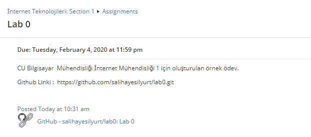
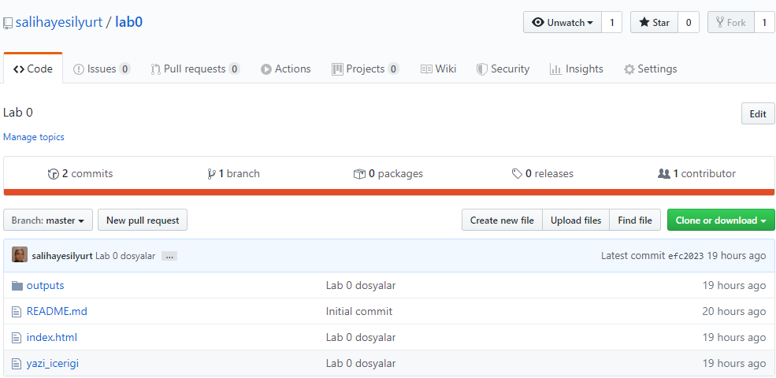
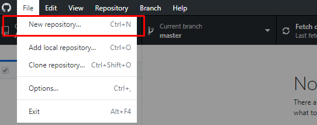
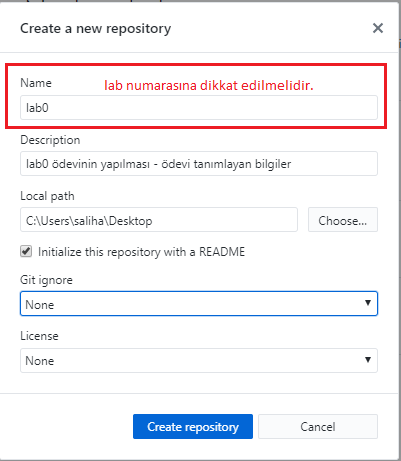
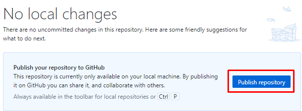
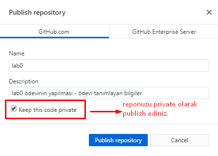
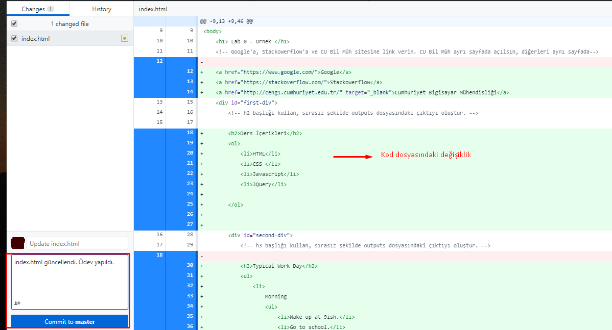
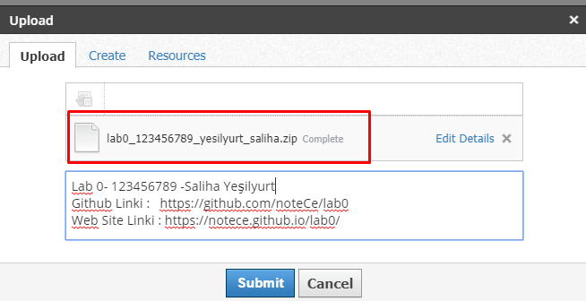
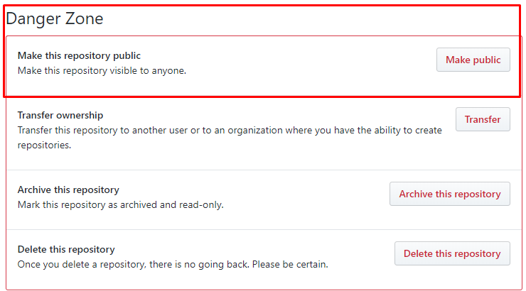

# Ödevinizi Github ve Schoology Üzerinden Gönderme

Ödevlerinizi [Github](https://github.com/) kullanarak  [Schoology](https://www.schoology.com/) üzerinden göndereceksiniz.

Her laboratuvar veya ödev teslim etmeniz gerektiğinde uygulayacağınız adımlar aşağıdadır.

1. Her ödev / laboratuvar için size bir GitHub reposu sunacağız. 

Gördüğünüz gibi bu ödev için : 
[https://github.com/salihayesilyurt/lab0.git](https://github.com/salihayesilyurt/lab0.git)


 

 
2. **“Clone or download”** butonuna tıklayın ve ödev için gerekli dosyaları .zip halinde indirin.
3. Github Desktop yardımı ile ya da komutlar ile yeni bir gizli repo oluşturun. Github Desktop uygulaması ile ilgili ekran görüntüleri aşağıdadır.  
(NOT : Bu işlemi yapabilmek için bilgisayarınızda Git yüklü olmalıdır. Github Desktop ya da Source Tree gibi yardımcı araçları da kullanabilirsiniz. )






4. Reponuzu kendi hesabınızla yayınlayınız.




5. Projeyi publish ederken `private (gizli)` olmasına dikkat ediniz.



6. Eğer private yapmayı unutursanız github.com'dan reponun `Settings --> Danger Zone` kısmında yer alan yerden de yapabilirsiniz.
7. Kodlama yapmak için kullandığınız editör yardımıyla sizden istenen ödevi gerçekleştiriniz ve Github’a değişikliklerinizi gönderiniz.(`Push`)

 

8. Ödevinizin tamamlanmış halinin `ekran görüntülerini`, `video`sunu, `gif`ini repoda yer alan outputs dosyasına ekleyiniz.


Tam sayfa ekran görüntüsü için kullanabileceğiz Chrome eklentisi :  [Chrome Web Mağazası | Easy Screen Capture - save &amp; send screenshots](https://chrome.google.com/webstore/detail/easy-screen-capture-save/ejkbkgbliokmbblkklofdehalgbplkfg)

Ekran videosu almak için Chrome eklentisi : [Chrome Web Mağazası | Screen Recorder](https://chrome.google.com/webstore/detail/screen-recorder/hniebljpgcogalllopnjokppmgbhaden).

Bu aracı kullanacaksanız **Uygulama Penceresi** modunda çalıştırın. Chrome Sekmesi modunda çalıştırdığınız zaman başka sekmeye geçtiğinde görünmüyor.

Farklı araçları da kullanabilirsiniz.

9. Ödevinizi tamamladığınızdan emin olduğunuzda, gönderim tarihine kadar, `Schoology’de`  yer alan  `Submission` kısmından ödevinizi  `zip` olarak sisteme yükleyiniz.

`labNo_ogrenciNo_soyad_ad.zip`

***Gönderim formatı da aşağıdaki şekilde olmalıdır. Gönderim kısmında yer alan metin kısmı aşağıdaki şekilde doldurulmalıdır. Bu formata uymayan ödevler kabul edilmeyecektir.***

```
Lab No  - Öğrenci Numarası - Ad Soyad
Github Linki :   https://github.com/noteCe/lab0
Video Linki : https://drive.google.com/open?id=1OvqoQzRmIm1BC1B_tuVDfqwGRDh09JIs
```
(NOT :Videonuzu Drive hesabı linki olarak ya da Youtube linki olarak paylaşabilirsiniz.)



10. Ayrıca videonuzu `gif`e çevirip `README.md` dosyasına aşağıdaki gibi eklemeniz yararınıza olacaktır.

``

`Gif`e çevirme aracı : [https://convertio.co/tr/mp4-gif/](https://convertio.co/tr/mp4-gif/)  (örnektir, istediğinizi kullanabilirsiniz)

11. Ödev gönderim tarihinden **1 gün sonra**  Settings – Danger Zone alanından `Make Public` diyerek herkese görünür yapınız. Verilen github linki değişmeyecektir.



12. **Ödevinizin başkası tarafından kopyalanmaması sizin sorumluluğunuzdadır.** Birbirinin kopyası olan ödevler 0 olarak notlandırılacaktır.